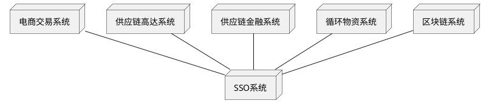
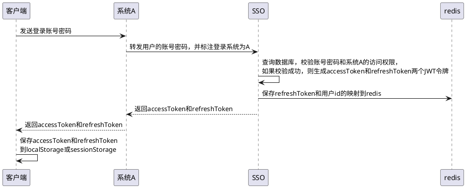
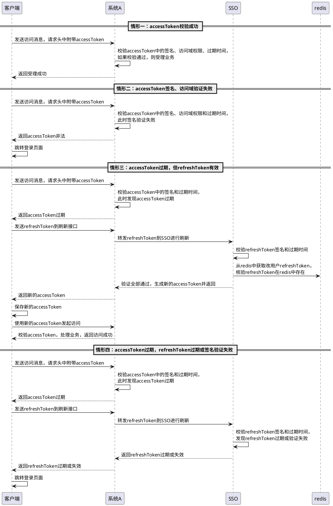
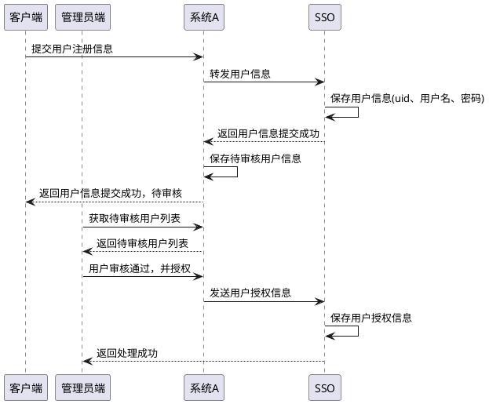
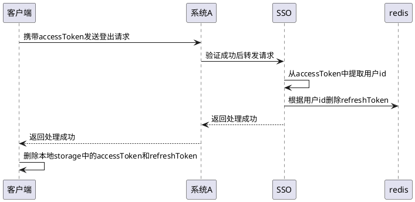

<h1>SSO系统建设方案</h1>

# 1. 方案背景

当前主流电商平台对于用户登录授权、身份管理是十分友好的，均具备单点登录、各个系统用户身份信息共享功能。而钢宝网近期着手循环物资电商平台、供应链金融、区块链浏览器等项目开发，每个项目系统相对独立，与钢宝一期、二期系统不能共享用户管理，这对钢宝网客户和内部管理人员的使用体验不够友好。从长期平台发展角度看，钢宝网也需要具备用户身份统一管理的能力，建设统一管理平台，提供通用用户登录注册及身份管理服务，为各个现有业务系统和未来扩张业务系统提供支持。在此我们提出建设一个用户身份单点登录后台系统（简称SSO系统），为各个业务系统提供用户身份管理服务。

# 2. 方案目标

* 建立SSO系统，与各个现有业务系统及将开发的业务系统进行对接，为各个业务系统提供用户注册、登录、用户身份信息查询、授权令牌创建更新、用户管理等服务。
* 支持钢宝客户在钢宝网上所有业务系统的单点登录。
* 支持钢宝内部管理人员在钢宝各个业务后台系统的单点登录。

# 3. 设计思想

* 考虑到各个系统的登录授权的差异性和复杂性，使用主流无状态单点登录令牌技术JWT实现系统的单点登录控制，无需服务器对Session的保存，解除业务接口对Session的依赖，支持新系统的扩张。JWT令牌将由SSO系统统一颁发和管理，各业务系统可以对JWT令牌进行核验。
* SSO系统集中保存用户ID、用户名、密码和系统权限，并以接口形式为各个系统提供用户信息查询服务。此功能需要SSO的用户注册信息字段兼容各个现有系统的用户信息字段，并将已有系统的用户通用信息数据（如用户ID、用户名、密码、授权）迁移到SSO系统数据库中，业务特征较强的用户数据（如业务系统用户状态，用户附加信息，用户资金数据，会员个性化数据，用户积分等）继续由各业务系统管理。
* 为向前兼容各个业务系统的用户管理板块，用户登录注册的前端页面还沿用各个业务系统的页面，但是后台用户管理页面由SSO系统提供。


# 4. 设计详述

## 4.1. 系统架构



* SSO用户表示例

|uid|用户名|密码|授权|
|---|------|---|----|
|1|user1|abc|["trade":["role_biz","role_admin"],"recy":["role_admin"]]|
|1|user2|cde|["trade":["role_biz","role_admin"],"recy":["role_biz"]]|
|1|user3|asd|["trade":["role_customer"]]|

* 所有业务系统的登录授权需要SSO系统受理，校验成功后由SSO系统颁发JWT，经由各个业务系统转发给用户前端保存。
* 用户访问各个业务系统的请求中需要携带JWT令牌，各个业务系统在处理请求之前先由拦截器校验JWT，校验通过后再进行业务处理。
* 所有业务系统的用户注册信息（用户名、密码）需提交给SSO系统保存。
* 用户通用数据将由SSO系统统一提供查询接口，各个业务系统的用户通用数据查询需要从SSO系统获取。
* 用户ID编号将由SSO系统统一生成和管理，ID生成后返回给各个业务系统备份储存。
* 用户访问授权由各个业务系统控制管理，SSO系统中会统一收集保存用户到各个系统/模块的访问授权，如上表所示。
* 用户审核、禁用等管理动作由各个业务系统管理，并转化成系统新授权的形式发送给SSO。
* 客户数据和钢宝内部管理员数据将在SSO系统中分别管理。

## 4.2. JWT令牌设计

我们采用accessToken和refreshToken双JWT令牌设计，用于解决超时刷新问题。
accessToken为控制会话有效期的token，有效时间建议在5min。
refreshToken为更新用的令牌，有效时间建议在7天，用于在accessToken过期后在refreshToken有效时间内免登录更新accessToken。

### 4.2.1. jwt结构

header结构

```json
{
  'typ': 'JWT', //令牌类型JWT
  'alg': 'HS256' //签名算法类型
}
```

payload结构

```json
{
  'iss':'SSO', //jwt签发者
  'sub':'userid', //jwt所面向的用户，即用户id
  'exp':'1587708097830', //jwt的过期时间，这个过期时间必须要大于签发时间
  'iat':'1587708090000', //jwt的签发时间
  'jti':'bba555da-fb86-466d-b01d-3816ce3a9256', //jwt的唯一身份标识，主要用来作为一次性token,从而回避重放攻击。
  'dom':'["trade":["role_biz","role_admin"],"recy":["role_biz"]]', //此项为自定义claim，表示用户可以访问的系统授权
  'ttyp':'access' //此项为自定义claim，表示是accessToken还是refreshToken
}
```
jwt最后会附加发行者签名，以便进行内容校验，以防篡改。

## 4.3. 业务流程讲解

以业务系统A的用户登录、业务访问、注册、登出动作为例讲解业务流程

### 4.3.1. 登录




### 4.3.2. 业务访问



### 4.3.3. 注册



### 4.3.4. 登出



# 5. SSO系统前端页面设计

* 前端需要在localStorage或sessionStorage中保存用户的双Token
* 需要封装一个方法，当发现accessToken超时后，立刻发送refreshToken到后端获取最新的accessToken，如果refreshToken超时或非法，需要跳转到login页面
* 用户登出后，需要删除localStorage/sessionStorage中的双token
* 